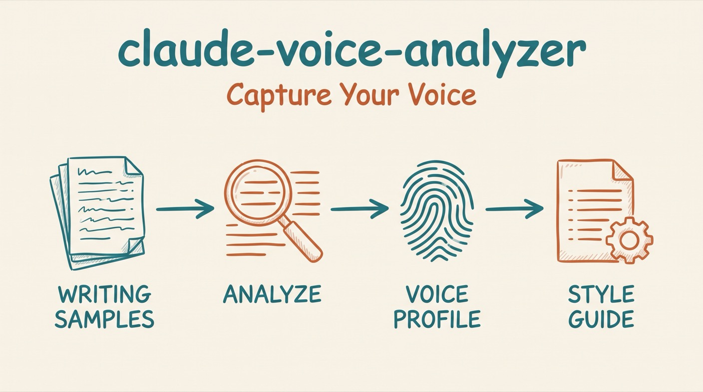

# Voice Analyzer

*Voice profiles that let AI produce content readers recognize as authentically yours.*




A Claude Code skill for creating portable voice profiles from writing samples. It extracts your voice patterns from samples you provide and generates a reusable VOICE.md style guide.

## Why

AI writing often sounds generic because it has no reference for your actual voice. This results in:

- Content that "could have been written by anyone"
- Loss of personality and distinctive style
- The need to heavily edit every AI output
- Readers noticing the shift from your authentic voice

This skill extracts your voice patterns and creates a reusable style guide.

## Install

```bash
# In Claude Code:
/plugin marketplace add aplaceforallmystuff/marketplace
/plugin install claude-voice-analyzer@jim-christian
```

<details>
<summary>Manual install (without the marketplace)</summary>

```bash
# Clone the repository
git clone https://github.com/aplaceforallmystuff/claude-voice-analyzer.git

# Copy to your Claude Code skills directory
cp -r claude-voice-analyzer/skills/voice-analyzer ~/.claude/skills/
```
</details>

## Use cases

- Use it when you set up voice-matched AI writing and need a reference the AI can follow every time.
- Use it when you onboard to a new project and want the AI to write in your voice from day one.
- Use it when an existing style guide is outdated and needs a refresh from recent samples.
- Use it when AI drafts keep sounding generic and you want a forbidden-phrases list tuned to your anti-patterns.
- Use it when you maintain separate voices (professional, casual, technical) and need a profile for each.

## How it works

Provide 3-5 writing samples where your voice feels strongest. The skill:

1. **Analyzes** patterns across all samples
2. **Identifies** your distinctive voice markers
3. **Generates** a VOICE.md style guide
4. **Creates** a forbidden phrases list specific to your anti-patterns
5. **Provides** testing prompts to validate the guide

### What it analyzes

| Dimension | What It Examines |
|-----------|------------------|
| **Sentence Patterns** | Length, variation, starters, fragment usage |
| **Vocabulary** | Formality, jargon, characteristic phrases |
| **Rhythm** | Paragraph length, transitions, pacing |
| **Tone** | Humor style, directness, reader relationship |
| **Structure** | Lists vs prose, headers, formatting |
| **Opinion** | How you state views, qualify claims, express authority |

### Sample selection

**Good samples:**
- Newsletter issues you're proud of
- Blog posts that felt natural
- Emails where your voice came through
- Social media threads that "felt like you"

**Avoid:**
- Heavily edited corporate content
- Collaborative pieces
- Anything that felt forced

### Output: VOICE.md

The skill generates a comprehensive style guide including:

```markdown
# Voice Profile: [Name]

## Voice Summary
[2-3 sentence description of overall voice]

## Core Characteristics
- Sentence patterns
- Vocabulary fingerprint
- Rhythm and flow
- Tone markers
- Structural habits
- Opinion expression style

## The Forbidden List
- Never use (these kill your voice)
- Use sparingly (context-dependent)
- Watch for clusters (OK alone, bad together)

## Testing Prompts
[Prompts to validate the guide works]
```

### Where to save VOICE.md

| Location | Scope |
|----------|-------|
| `./.claude/VOICE.md` | This project only |
| `~/.claude/voice/VOICE.md` | All projects |
| `~/.claude/voice/[context]-voice.md` | Multiple profiles (professional, casual) |

## Example

Ask Claude to analyze your writing and point it at your samples:

> Analyze my writing voice from these three newsletter issues and generate a VOICE.md.

The skill reads the samples, works through each dimension, and returns a profile. Illustrative excerpt of the generated VOICE.md:

```markdown
# Voice Profile: Jim
Generated: 2026-08-18
Based on: 3 writing samples (4,200 words)

## Voice Summary
Direct and conversational. Short sentences for emphasis, longer ones
to carry an argument. Dry humor, no corporate hedging.

## The Forbidden List
### Never Use (These kill your voice)
- "It's worth noting that"
- "In today's digital landscape"
- "Leverage" as a verb
```

*(Output above is illustrative — actual profiles reflect your own samples.)*

## Related Skills

Part of the [aplaceforallmystuff](https://skills.sh/aplaceforallmystuff) skills collection:

- **[voice-editor](https://github.com/aplaceforallmystuff/claude-voice-editor)** — Uses the VOICE.md this skill generates to guide rewrites
- **[the-antislop](https://github.com/aplaceforallmystuff/the-antislop)** — Detect and fix AI writing patterns
- **[slop-detector](https://github.com/aplaceforallmystuff/claude-slop-detector)** — References VOICE.md for personalized pattern detection

## License

MIT — see [LICENSE](LICENSE).
